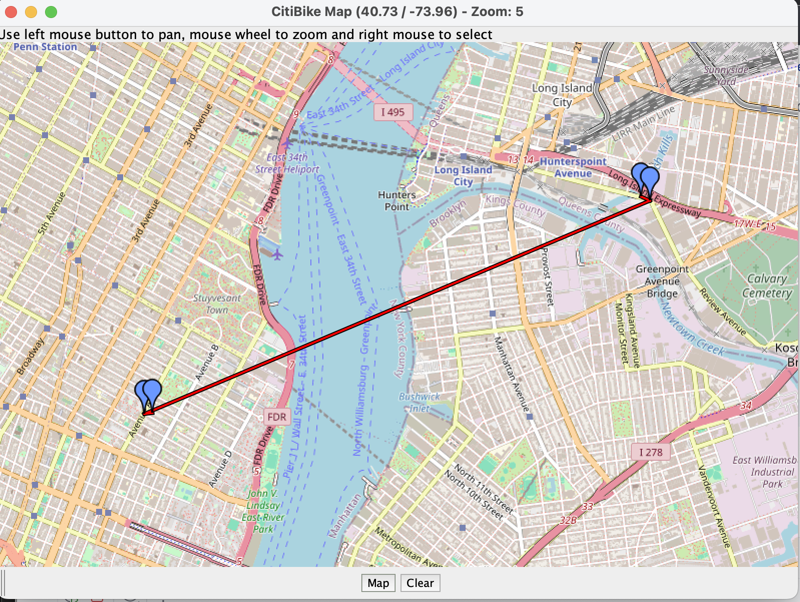

# CitiBike Station Finder

## Overview
This CitiBike StationFinder allows users to find the 
closest CitiBike stations to their origin and destination of choice. 

### How it works
This application uses AWS Lambda to generate a request from the CitiBike API. 
The results of that request are used to calculate the closest stations to the user's
given location as well as if there are available bikes and slots for the user.  
Then the results are displayed in a map GUI so the user can clearly see
where the closest stations are.

### Directions
Click on any two points on the map to pick an origin and a destination.

An example is shown below:

If you mistakenly choose too many points, you can press clear to 
delete the points. 

When you are ready to view the results, press Map. 
If you have less than 2 points or more, an error message will appear.

Just press OK, clear your points, and start again.

Your results should look something like this:

The map should include your origin and destination, as well as the 
closest stations to those points. 

